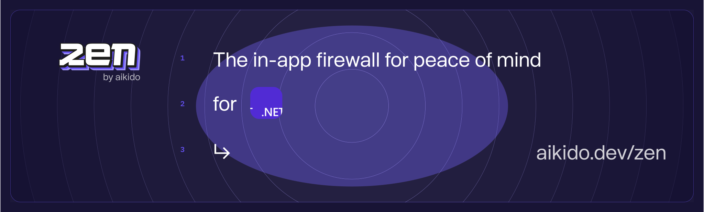

# Zen, in-app firewall for .NET | by Aikido
[](https://app.codecov.io/gh/aikidosec/firewall-dotnet)
[](http://makeapullrequest.com)
[](https://github.com/AikidoSec/firewall-dotnet/actions/workflows/unit-test.yml)
[](https://www.nuget.org/packages/Aikido.Zen.DotNetCore/)
[](https://www.nuget.org/packages/Aikido.Zen.DotNetFramework/)

Zen, your in-app firewall for peace of mind– at runtime.

Zen is an embedded Web Application Firewall that autonomously protects your .NET apps against common and critical attacks.

Zen protects your .NET apps by preventing user input containing dangerous strings, which allow SQL injections. It runs on the same server as your .NET app for easy installation and zero maintenance.

Zen for .NET currently supports onwards of .NET 4.6. The latest tested version is .NET 9.0.

## Features

Zen will autonomously protect your .NET applications from the inside against:

* 🛡️ [SQL injection attacks](https://www.aikido.dev/blog/the-state-of-sql-injections)
* 🛡️ [Path traversal attacks](https://www.aikido.dev/blog/path-traversal-in-2024-the-year-unpacked)
* 🛡️ [Command injection attacks](https://www.aikido.dev/blog/command-injection-in-2024-unpacked)
* 🚧 [Server-side request forgery (SSRF)](https://owasp.org/www-community/attacks/Server_Side_Request_Forgery)
* 🚧 [NoSQL injection attacks](https://www.aikido.dev/blog/web-application-security-vulnerabilities)

Zen operates autonomously on the same server as your .NET app to:

* ✅ Secure your app like a classic web application firewall (WAF), but with none of the infrastructure or cost.
* ✅ Rate limit specific API endpoints by IP or by user
* ✅ Allow you to block specific users manually
* ✅ Allow you to block bots and AI scrapers
* ✅ Allow you to allow traffic by ip per endpoint
* ✅ Allow you to bypass the firewall by ip
* ✅ Geo-fencing to block or allow a selection of countries


## Supported libraries and frameworks

### Web frameworks
* ✅ ASP.NET Core 6.0
* ✅ ASP.NET Core 7.0
* ✅ ASP.NET Core 8.0
* ✅ ASP.NET Core 9.0
* ✅ ASP.NET Framework 4.6.x
* ✅ ASP.NET Framework 4.7.x
* ✅ ASP.NET Framework 4.8.x

### Database drivers
* ✅ Microsoft.Data.SqlClient
* ✅ System.Data.SqlClient
* ✅ System.Data.SqlServerCE (.NET Framework)
* ✅ Microsoft.Data.Sqlite
* ✅ MySql.Data.MySqlClient
* ✅ MySqlConnector
* ✅ Npgsql
* ✅ MySqlX

### Supported ORM frameworks
* ✅ NPoco
* ✅ EF Core

## Installation

### .NET Core

Ensure that your project runs on .NET Core 6, 7, 8 or 9

> [!IMPORTANT]
> [ARM is not supported at this time](https://github.com/AikidoSec/firewall-dotnet/issues/113)

- Install the package from NuGet:

``` shell
dotnet add package Aikido.Zen.DotNetCore
```

- Add the following to your `appsettings.json` file: (use secrets manager to store the API key)

``` json
{
  "Aikido": {
    "AikidoToken": "your-api-key"
  }
}
```

- or add it as an environment variable

``` shell
AIKIDO_TOKEN=<YOUR-TOKEN-HERE>
```

If you are using a startup class, you can add the following to your `Startup.cs` file:

``` csharp
public void ConfigureServices(IServiceCollection services)
{
    // other services
    services.AddZenFirewall(Configuration);
    // other services
}

public void Configure(IApplicationBuilder app)
{
    // other middleware
    app.UseZenFirewall(); // place this after userouting, or after authorization, but high enough in the pipeline to catch all requests
    // other middleware
}
```

You can also set the user in your custom middleware, if you would like to block users by their identity.

``` csharp
// ...
using Aikido.Zen.DotNetCore;
using Microsoft.AspNet.Identity;
// ...
// add routing
    .UseRouting()
    // authorize users
    .Use((context, next) =>
    {
        // unique id for the user
        var id = context.User?.Identity?.GetUserId() ?? "test";
        // name for the user, can be same as id
        var name = context.User?.Identity?.Name ?? "Anonymous";
        if (!string.IsNullOrEmpty(id))
            Zen.SetUser(id, name, context);
        return next();
    })
    // add Zen middleware
    .UseZenFirewall()
```

### .NET Framework

Ensure that your project runs on .NET Framework 4.6 or higher.

> [!IMPORTANT]
> [ARM is not supported at this time](https://github.com/AikidoSec/firewall-dotnet/issues/113)

- Install the package from NuGet:

``` shell
dotnet add package Aikido.Zen.DotNetFramework
```

or

``` shell
Install-Package Zen.Aikido.DotNetFramework
```

- To add the Aikido token in the Web.config file, follow these steps:

1. Open your `Web.config` file.
2. Locate the `<appSettings>` section.
3. Add the following key-value pair within the `<appSettings>` section:

``` xml
<add key="Aikido:AikidoToken" value="your-api-key" />
```

- in your Global.asax.cs file, add the following:

``` csharp
protected void Application_Start()
{
    // other code
    Zen.Start();
}
```

if you are using OWIN, you can add the following to your `Startup.cs` file:

``` csharp
public void Configuration(IAppBuilder app)
{
    // other code
    Zen.Start();
}
```

- If you would like to block users by their identity, you can pass in a function to set the user, in your Global.asax.cs file.

``` csharp
public void Application_Start()
{
    // other code
    Zen.SetUser(context => new User(context.User.Identity.Name, context.User.Identity.Name));
    Zen.Start();
}
```

Or if you are using OWIN, you can add the following to your `Startup.cs` file:

``` csharp
// ...
using Aikido.Zen.DotNetFramework;
using Aikido.Zen.Core;
using Microsoft.AspNet.Identity;
// ...
public void Configuration(IAppBuilder app)
{
    // other code
    // set the user, id should be unique, name can be same as id if needed
    Zen.SetUser(context => new User(context.User.Identity.GetUserId(), context.User.Identity.Name));
    Zen.Start();
}
```

## Reporting to your Aikido Security dashboard

> Aikido is your no nonsense application security platform. One central system that scans your source code & cloud, shows you what vulnerabilities matter, and how to fix them - fast. So you can get back to building.

Zen is a new product by Aikido. Built for developers to level up their security. While Aikido scans, get Zen for always-on protection.

You can use some of Zen’s features without Aikido, of course. Peace of mind is just a few lines of code away.

But you will get the most value by reporting your data to Aikido.

You will need an Aikido account and a token to report events to Aikido. If you don't have an account, you can [sign up for free](https://app.aikido.dev/login).

Here's how:
* [Log in to your Aikido account](https://app.aikido.dev/login).
* Go to [Zen](https://app.aikido.dev/runtime/services).
* Go to apps.
* Click on **Add app**.
* Choose a name for your app.
* Click **Generate token**.
* Copy the token.
* Set the token as the environment variable `AIKIDO_TOKEN`


## Running in production (blocking) mode

By default, Zen will only detect and report attacks to Aikido.

To block requests, set the `AIKIDO_BLOCK` environment variable to `true`.

See [Reporting to Aikido](#reporting-to-your-aikido-security-dashboard) to learn how to send events to Aikido.

## Additional configuration

[Configure Zen using environment variables for authentication, mode settings, debugging, and more.](https://help.aikido.dev/doc/configuration-via-env-vars/docrSItUkeR9)

## License

This program is offered under a commercial and under the AGPL license.
You can be released from the requirements of the AGPL license by purchasing
a commercial license. Buying such a license is mandatory as soon as you
develop commercial activities involving the Zen software without
disclosing the source code of your own applications.

For more information, please contact Aikido Security at this
address: support@aikido.dev or create an account at https://app.aikido.dev.

## Performance

 Under construction 

## Code of Conduct

See [CODE_OF_CONDUCT.md](.github/CODE_OF_CONDUCT.md) for more information.

## Security

Our bug bounty program is public and can be found by all registered Intigriti users at: https://app.intigriti.com/researcher/programs/aikido/aikidoruntime

See [SECURITY.md](.github/SECURITY.md) for more information.
